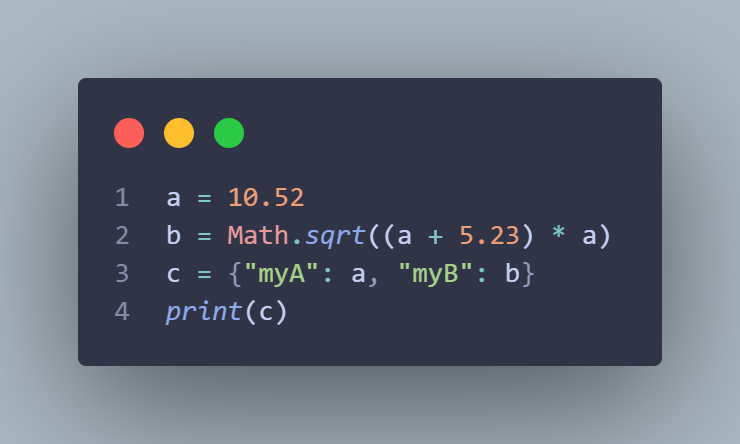

<h1 style="display:flex;align-items:center">&nbsp;Radon</h1>

Radon is a programming language that gets compiled to Minecraft: Java Edition's mcfunction files.



## Discord Server

<a target="_blank" href="https://discord.gg/xYjXnDp6h3"></a>

## Documentation

Documentation is available on [GitHub Pages.](https://oguzhanumutlu.github.io/radon/)

## Usage

First install the package using:

```shell
pip install radonmc
```

Now run `radon` while being inside your datapack's folder and that's it!

## Syntax

```js
a = 10
a += 10
a -= 10
a *= 10
a /= 10
a++
a--

b = 10.5
c = [1, 2, 3]
d = [c, c, c]
e = {"myKey": a, "myOtherKey": c, "myOtherOtherKey": d}
e.myOtherOtherKey[0][2] // this is c[2] which is 3

// To run commands just type them:
say hi

// Multi line commands are available, you can break the new line character with backslash:
execute       \
  as @a       \
  at @s       \
  run say hi

// If you want to define a variable with no initial value you just do this:
define int my_var

a += c[2] - (d[0][1] * 10) / (d[1][2] + 7) // Supports mathematical expressions

// You can break lines in expressions too!
val = 10 + \
 5 - 4 * \
 a + 5

fl = 10.5
fl += 5.23

a:@s = 10 // sets it for @s

a:@s // gets it from @s

fn my_func(float x, float y, float z) {
    tp @a $(x) $(y) $(z)
    return x + y + z
}

my_func(1.3, 2.7, 3.3)

fn tick {
    // This will run every tick
}

as @p at @s {
}

if (a == 1) {
} else if (a == 2) {
} else {
}

// Some more syntactic sugar for readability! (Optional)
if (a is 1 or b is 5) {

}

unless (a == 1) { // This is a shortcut for: if (a == 1) {} else { say hi }
  say hi
}

schedule 1t {
}

loop {
}

for (i = 0; i < 10; i++) {
}

while (a == 1) {
}

until (a == 1) {
}

do {
} while (a == 1)

do {
} until (a == 1)

loop 1t {
}

for 1t (i = 0; i < 10; i++) {
}

while 1t (a == 1) {
}

until 1t (a == 1) {
}

do {
} while 1t (a == 1)

do {
} until 1t (a == 1)

// break and continue can be used in any loop like this:

loop {
    if (a == 1) break // Exits the loop
    if (a == 2) continue // Stops the loop and restarts from the first line of the loop
}

class MyClass {
    a = 10
    b = [1, 2, 3]
    
    MyClass(int a) {
        this.a = a
        this.b[0] = 5
    }
    
    increaseTheA() {
        this.a++
    }
}

myInstance = MyClass(50)
myInstance.increaseTheA()

print(myInstance.a) // it's 51
```
